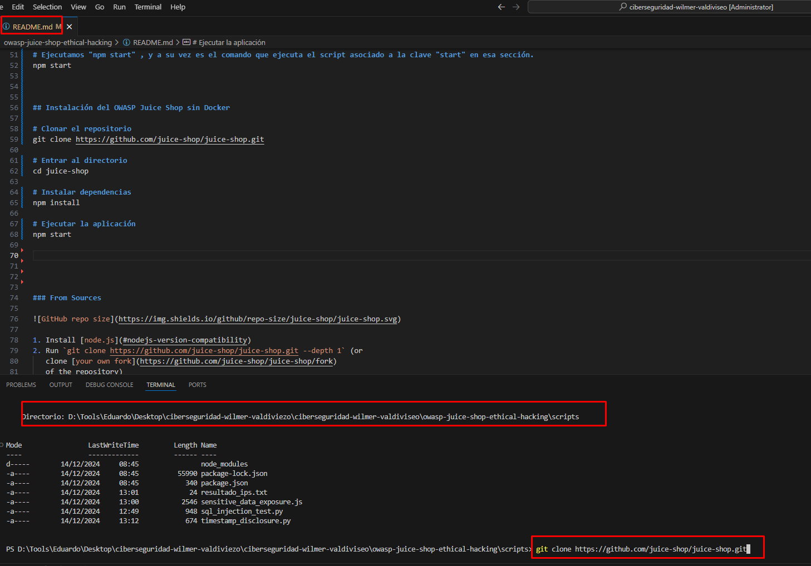

# Prueba Ciberseguridad-Wilmer-Valdiviezo

Este repositorio contiene Scripts y documentación para identificar, reproducir y mitigar vulnerabilidades en OWASP Juice Shop

## Contenido del Repositorio

[owasp-juice-shop-ethical-hacking]
│
├── [scripts/](#Esta carpeta contiene los scripts de las pruebas implementadas)
│   ├── sql_injection_test.py
│   ├── xss_exploit.js
│   └── broken_auth_test.py
├── [docs/](#Esta carpeta contiene los documentos de las pruebas implementadas)
│   ├── 01_sql_injection.md
│   ├── 02_xss.md
│   └── 03_broken_auth.md
│   └── [images/](#Esta carpeta contiene los imágenes de las pruebas implementadas)
│
└── [README.md] (# Instrucciones para configurar el entorno y ejecutar pruebas)

## Requisitos Previos

> Antes de compensar, asegúrate de tener instaladas las siguientes herramientas

> [Node](https://nodejs.org/dist/v22.12.0/node-v22.12.0-x64.msi)
> [GitHub Desktop](https://central.github.com/deployments/desktop/desktop/latest/win32)
> [Git - Downloading Package](https://github.com/git-for-windows/git/releases/download/v2.47.1.windows.1/Git-2.47.1-64-bit.exe)
> [Visual Studio Code](https://code.visualstudio.com/sha/download?build=stable&os=win32-x64-user).
> [Java SE 20 Archive ](https://download.oracle.com/graalvm/20/archive/graalvm-jdk-20.0.2_windows-x64_bin.zip)
> [ZAP Proxy](https://github.com/zaproxy/zaproxy/releases/download/v2.15.0/ZAP_2_15_0_windows.exe)

Una vez que conectamos el repositorio GitHub con el Visual Studio Code, desde el terminal validamos e instalamos pasos previos antes de la instalación:

# Se verifica la instalación del Node
node --version

# Instala la librería requests en tu entorno de Python. La librería requests es una de las más populares para realizar solicitudes HTTP de manera sencilla y eficiente en Python
pip install requests 

# Se verifica la instalación del Python
python --version

# Se utiliza para instalar todas las dependencias de un proyecto en Node.js que están especificadas en el archivo package.jso
npm install

# Instala el paquete Puppeteer en tu proyecto. Puppeteer es una librería de Node.js que proporciona una API de alto nivel para controlar un navegador web (generalmente Chromium) de forma programática
npm install puppeteer

# Instala Axios, cuya  librería  hacer solicitudes HTTP (similar a fetch en el navegador, pero con más funcionalidades como la gestión de errores, interceptores)
# Instala Cheerio, cuya librería facilita el scraping de páginas HTML, proporcionando una API similar a jQuery para manipular el contenido HTML.
npm install axios cheerio

# Crea un archivo package.json en tu proyecto de Node.js. Este archivo es esencial para administrar las dependencias, configuraciones y scripts de tu proyecto
npm init -y

# Muestra un informe sobre las vulnerabilidades de seguridad que podrían existir en las dependencias de tu proyecto
npm audit report

### Instalación del OWASP Juice Shop sin Docker

1. # Clonar el repositorio
   git clone https://github.com/juice-shop/juice-shop.git
2. # Entrar al directorio
   cd juice-shop
3. # Instalar dependencias
   npm install
4. # Ejecutar la aplicación
   npm start
5. Browse to <http://localhost:3000>

         PS D:\Tools\Eduardo\Desktop\ciberseguridad-wilmer-valdiviezo\ciberseguridad-wilmer-valdiviseo\owasp-juice-shop-ethical-hacking> npm start

         > juice-shop@17.1.1 start
         > node build/app

         info: Detected Node.js version v22.12.0 (OK)
         info: Detected OS win32 (OK)
         info: Detected CPU x64 (OK)
         info: Configuration default validated (OK)
         info: Entity models 19 of 19 are initialized (OK)
         (node:18508) [DEP0040] DeprecationWarning: The `punycode` module is deprecated. Please use a userland alternative instead.
         (Use `node --trace-deprecation ...` to show where the warning was created)
         info: Required file server.js is present (OK)
         info: Required file index.html is present (OK)
         info: Required file styles.css is present (OK)
         info: Required file main.js is present (OK)
         info: Required file polyfills.js is present (OK)
         info: Required file runtime.js is present (OK)
         info: Required file vendor.js is present (OK)
         info: Port 3000 is available (OK)
         info: Domain https://www.alchemy.com/ is reachable (OK)
         info: Chatbot training data botDefaultTrainingData.json validated (OK)
         info: Server listening on port 3000
         info: Restored 2-star loginAdminChallenge (Login Admin)
         PS D:\Tools\Eduardo\Desktop\ciberseguridad-wilmer-valdiviezo\ciberseguridad-wilmer-valdiviseo\owasp-juice-shop-ethical-hacking>

## Documentation

# Ejecución de las Pruebas

> [Prueba 1: Injección SQL]
	•	Script: scripts/sql_injection_test.py
	•	Ejecuta con:

python scripts/sql_injection_test.py

> [Prueba 2: Exposición de datos sensibles]
	•	Script: scripts/sensitive_data_exposure.js
	•	Ejecuta con:

node scripts/sensitive_data_exposure.js

> [Prueba 3: Divulgación de Marca de Tiempo]

	•	Script: scripts/timestamp_disclosure.py
	•	Ejecuta con:

python scripts/timestamp_disclosure.py

## Contacto

Para consultas, escríbeme a [wvaldiviezo777@gmail.com] [valdiviezo_wilmer777@hotmail.com].