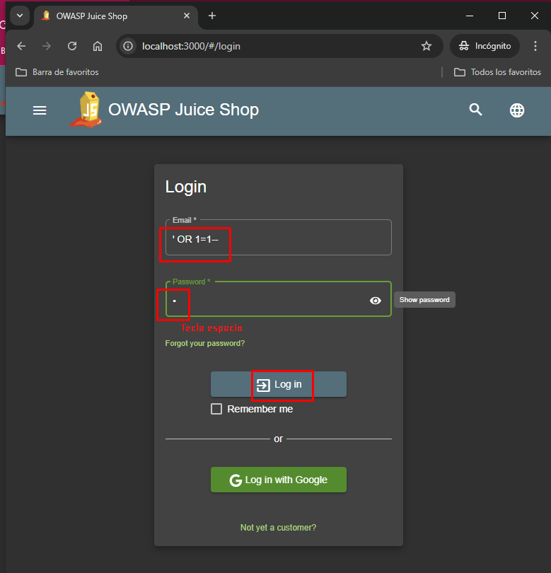
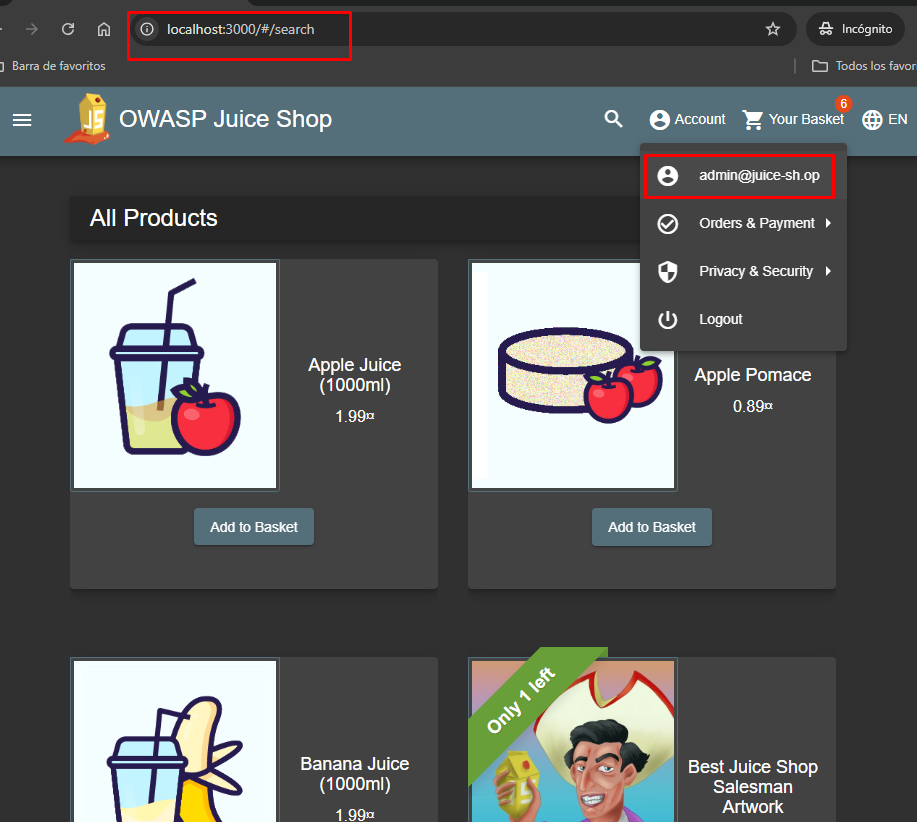
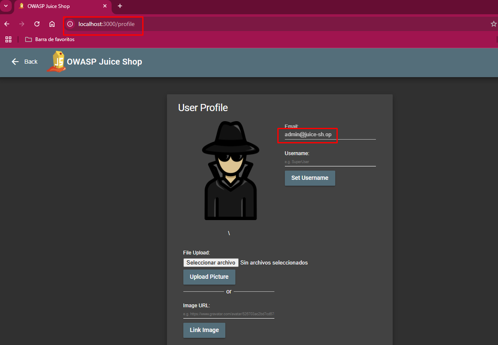
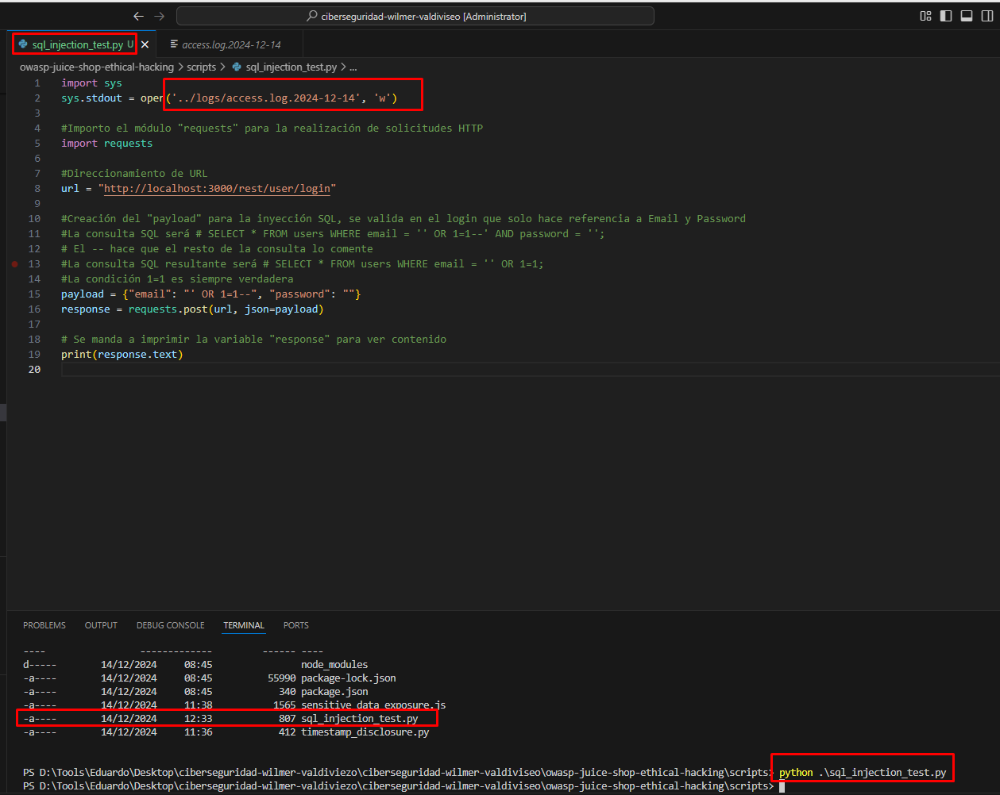
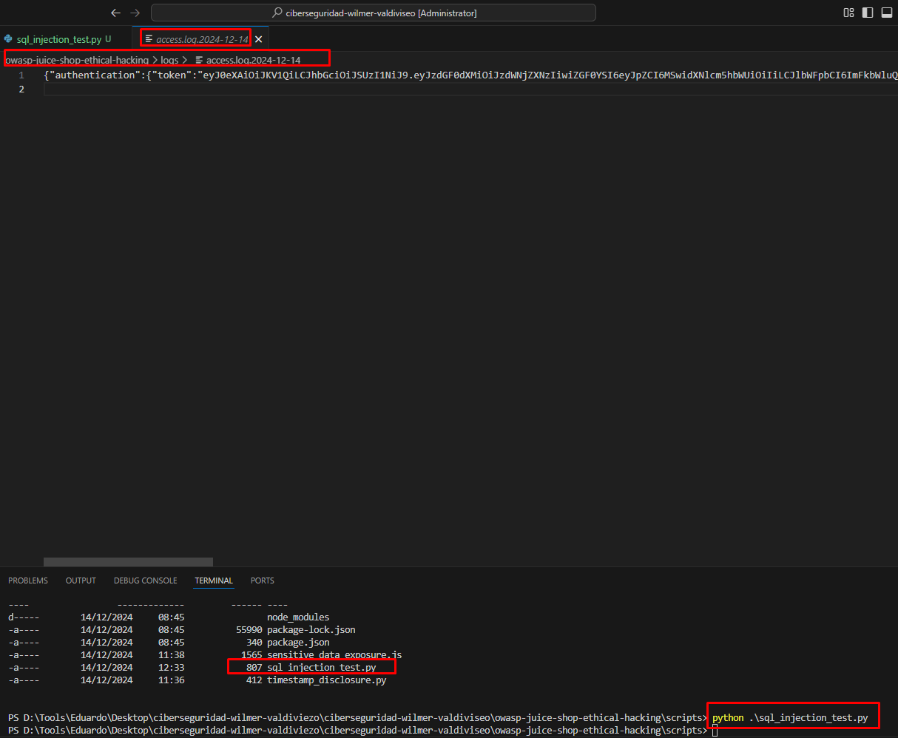
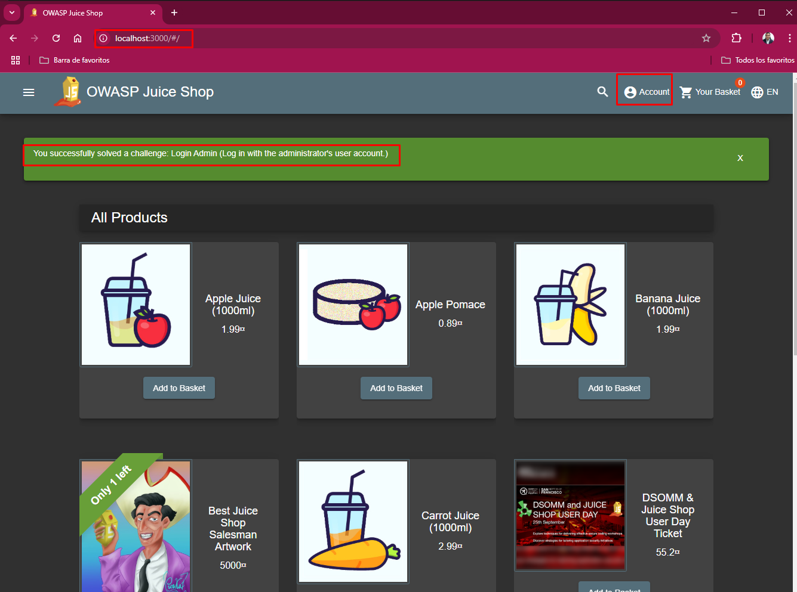

## [Inyección SQL]

### Descripción
La inyección SQL es una vulnerabilidad de seguridad que permite a los atacantes ejecutar comandos SQL maliciosos dentro de una aplicación web. 
En este caso, el ataque se realiza a través del formulario de login (http://localhost:3000/#/login), donde los parámetros de entrada (email y password) son utilizados directamente en una consulta SQL sin una adecuada validación.
El ataque busca modificar la consulta SQL generada en el servidor para que el atacante pueda manipularla; y solo así obtener acceso no autorizado. 
La consulta SQL original, cuando se inserta la carga útil maliciosa (' OR 1=1--), se convierte en una consulta que siempre será verdadera debido a la condición 1=1.

* Consulta SQL resultante:

[ SELECT * FROM users WHERE email = '' OR 1=1--' AND password = ''; 
El -- es un comentario en SQL, lo que significa que cualquier código posterior a esta parte será ignorado. 
La condición 1=1 siempre es verdadera, lo que permite al atacante acceder a la aplicación como si fuera un usuario válido.

### Impacto
1. Acceso no autorizado: El atacante puede acceder a cuentas de usuario sin necesidad de un nombre de usuario o contraseña válidos.
2. Robo de datos sensibles: Si el atacante puede ejecutar consultas SQL, puede obtener información confidencial, como contraseñas, correos electrónicos, o datos personales de los usuarios almacenados en la base de datos.
3. Compromiso del sistema: Dependiendo de la base de datos y las consultas disponibles, un atacante podría modificar, eliminar o robar datos.
4. Elevación de privilegios: En algunos casos, el atacante podría acceder a funciones de administración o cambiar roles de usuarios dentro de la aplicación.

### Prueba de Concepto

1. Pasos para replicar el ataque: 

Se creó un archivo script como paso #2 para la prueba reproducible.
Luego se pasó a ejecutar el script y las pruebas fueron favorables, se evidenció tanto en la interfaz web y en el terminal.
Por otro lado, se valida también en los logs lo comentado (access.log.2024-12-14)

2. Evidencias 

### Mitigación

- Cambios técnicos necesarios:

    * Uso de consultas preparadas: Utilizar parámetros en las consultas SQL para evitar que los usuarios puedan inyectar código SQL malicioso.
    * Validación y saneamiento de entradas: Asegurarse de que todos los datos introducidos por el usuario (como correos electrónicos y contraseñas) sean validados y limpiados para evitar caracteres especiales que puedan ser interpretados como código SQL.
    * Aplicar el principio de menor privilegio: Limitar los permisos de la base de datos para que los usuarios no puedan realizar consultas peligrosas.

- Buenas prácticas a implementar:

    * Utilizar ORM (Object Relational Mapping) en lugar de consultas SQL manuales para minimizar el riesgo de inyección SQL.
    * Hacer uso de listas blancas para validar las entradas de los usuarios.
    * Implementar un control de acceso adecuado que limite lo que un atacante puede hacer si logra explotar la vulnerabilidad.

    * Servicios a realizar con AWS

        a. Uso de Amazon RDS con seguridad (cifrado, control de acceso).
        b. Validación y saneamiento de entradas en el formulario de login.
        c. Uso de consultas preparadas para interactuar con la base de datos.
        d. Autenticación y autorización robustas con Amazon Cognito.
        e. AWS WAF para bloquear solicitudes de inyección SQL.
        f. Monitoreo y detección con CloudWatch y GuardDuty.
        g. API Gateway y Lambda con validación de entradas y control de acceso.
        h. AWS Secrets Manager para manejar las credenciales de manera segura.

### Relación con NIST

- ** Control NIST SP 800-53 **:
    SI-10 (Control de Entrada/Salida): Este control está enfocado en prevenir la inyección de código malicioso, como las inyecciones SQL, mediante la implementación de medidas que aseguren que los datos ingresados en el sistema sean válidos y que se filtren adecuadamente. En el caso de la inyección SQL, la correcta validación y saneamiento de las entradas de datos es clave para evitar la inserción de comandos maliciosos que puedan comprometer la base de datos.

- ** NIST Cybersecurity Framework (CSF) **:
    Funciones "Identify" y "Protect":
        Identify: Identificar vulnerabilidades en las aplicaciones y sistemas web es el primer paso para mitigar los riesgos asociados con la inyección   SQL. Esto incluye la evaluación continua de los sistemas para detectar posibles puntos débiles en el procesamiento de entradas y la exposición de datos sensibles. Las pruebas de penetración y auditorías de seguridad ayudan a identificar áreas vulnerables a la inyección SQL.
        
        Protect: Implementar medidas de seguridad como validación de entradas y monitoreo de accesos para proteger las aplicaciones de ataques de inyección SQL.