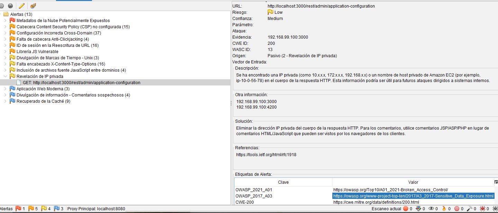
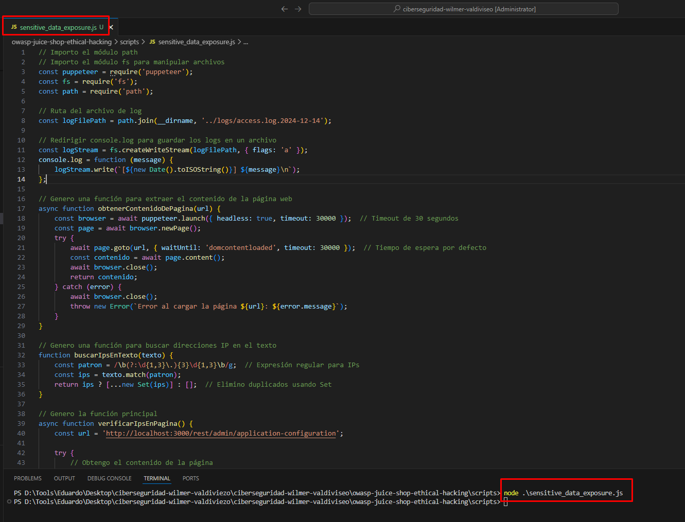
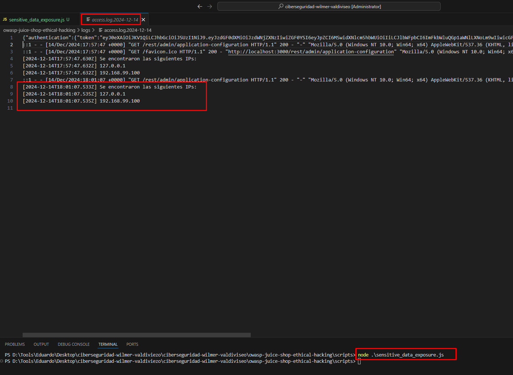

## [Exposición de datos sensibles]

### Descripción
Se logró encontrar direcciones IPs privadas (como 10.x.x.x, 172.x.x.x, 192.168.x.x) en el cuerpo de la respuesta HTTP. 
Esta información podría ser útil para futuros ataques dirigidos a sistemas internos.
Para este vulnerabilidad se usó el Aplicativo ZAP Proxy y donde evidenció el inconveniente en este enlace Web dentro del directorio: 
http://localhost:3000/rest/admin/application-configuration
Además, se creó un script personalizado para identificar y capturar direcciones IPs privadas en las respuestas HTTP de la aplicación.

* Consulta de resultado con el Script resultante:

[ IP detectada: 192.168.1.10 
[ IP detectada: 10.0.0.2
[ IP detectada: 172.16.0.3

### Impacto

El impacto de esta vulnerabilidad es significativo, ya que la exposición de direcciones IP privadas puede permitir a un atacante:

1. Reconocimiento y mapeo de red interna: Conociendo las direcciones IP internas, un atacante podría mapear los recursos internos de la red, permitiéndole identificar posibles objetivos de ataque.
2. Ataques dirigidos: Estas direcciones IP podrían utilizarse para ejecutar ataques más sofisticados dentro de la red interna, como ataques de reconocimiento, penetración o movimiento lateral.
3. Escalada de privilegios: Si un atacante consigue acceder a una red interna, podría intentar escalar privilegios a otros sistemas vulnerables o tomar el control de equipos clave. 

### Prueba de Concepto

1. Pasos para replicar el ataque: 

Se creó un archivo script como paso #2 para la prueba reproducible.
Luego se pasó a ejecutar el script y las pruebas fueron favorables, se evidenció tanto en la interfaz web y en el terminal.
Por otro lado, se valida también en los logs lo comentado (access.log.2024-12-14)

2. Evidencias 

### Mitigación

- Cambios técnicos necesarios

    * Eliminación de información sensible en las respuestas: Asegurarse de que las direcciones IP privadas, detalles del sistema o cualquier otra información sensible no se filtren en las respuestas HTTP. Esto puede lograrse filtrando o enmascarando esos datos antes de que lleguen al cliente.
    * Revisión de configuración del servidor: Validar que las configuraciones del servidor y las aplicaciones no expongan información interna de manera inadvertida. Esto incluye la revisión de código fuente, cabeceras HTTP y respuestas JSON.
    * Configuración de controles de acceso adecuados: Asegurar que solo los usuarios o sistemas autorizados tengan acceso a información sensible, implementando controles de acceso más estrictos.

- Buenas prácticas a implementar:

    * Cifrado de datos sensibles: Siempre cifrar datos sensibles en tránsito (usando HTTPS) y en reposo. Nunca exponer datos sensibles en texto plano.
    * Revisión de código de seguridad: Hacer auditorías regulares al código fuente para garantizar que no haya filtraciones de datos sensibles. Utilizar herramientas de análisis estático y dinámico para identificar vulnerabilidades.
    * Seguridad en el manejo de logs: Evitar que los logs contengan información sensible, como direcciones IP privadas, claves de acceso o detalles de configuración interna.
    * Prueba de penetración regular: Realizar pruebas de penetración y escaneos regulares para identificar puntos débiles en la exposición de datos.

    * Servicios a realizar con AWS

        a. Amazon GuardDuty: Para detectar actividad sospechosa y posibles accesos no autorizados a los recursos internos de la nube.
        b. AWS Web Application Firewall (WAF): Para proteger las aplicaciones web contra ataques comunes y filtrado de contenido no deseado, como la exposición de datos sensibles.
        c. AWS Secrets Manager: Para gestionar de forma segura los secretos (como claves API, contraseñas, etc.) y evitar su exposición accidental.

### Relación con NIST

- ** NIST SP 800-53 **: La exposición de datos sensibles se relaciona con controles de seguridad como el AC-17 (Remote Access), AC-19 (Access Control for Mobile Devices), y SC-12 (Cryptographic Key Establishment and Management).

- NIST SP 800-63  **: Enfocado en la gestión de identidades, la exposición de datos sensibles como direcciones IP privadas puede contravenir los principios de protección de la privacidad establecidos en las pautas del NIST para la autenticación.

    
        