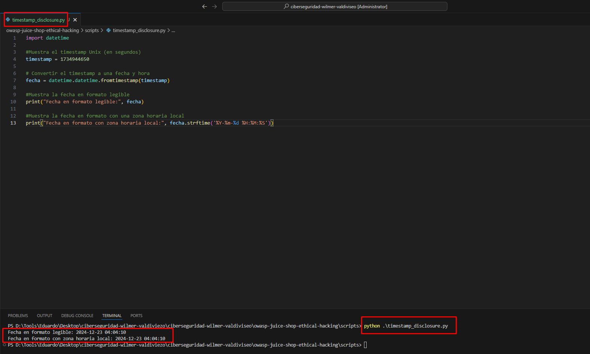
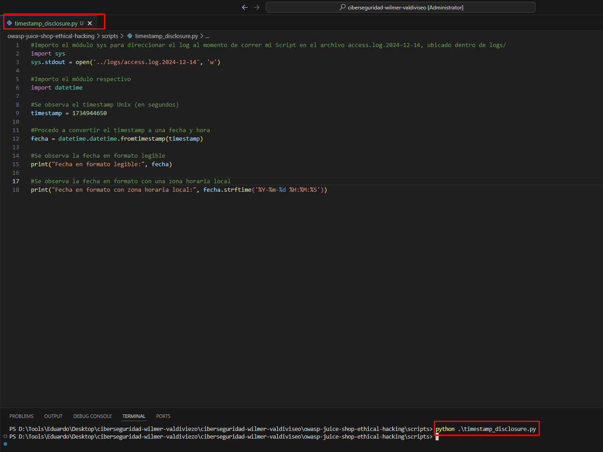
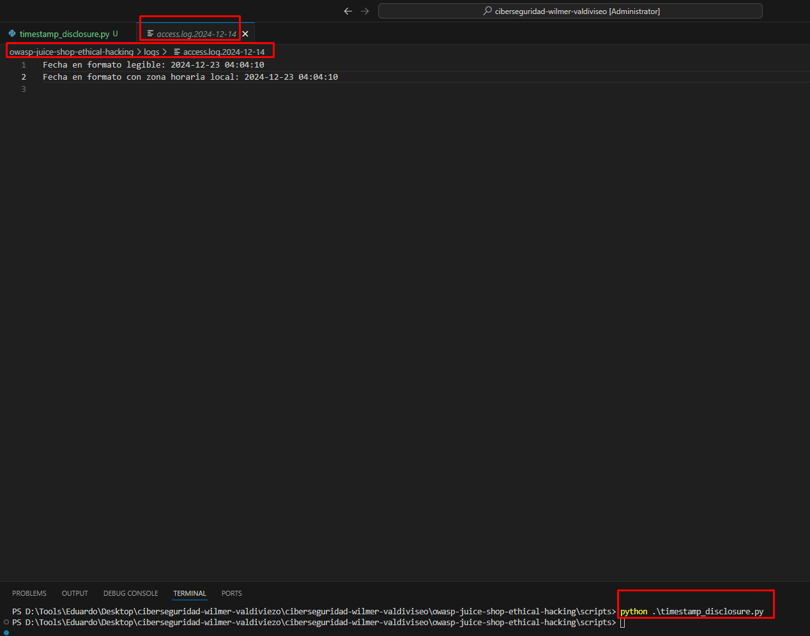

## [Divulgación de Marca de Tiempo]

### Descripción
La divulgación de marca de tiempo ocurre cuando una aplicación o servicio expone información relacionada con marcas de tiempo (timestamps) en las respuestas, cabeceras, mensajes de error o registros de eventos. Estas marcas pueden proporcionar información sensible que permite a los atacantes inferir comportamientos del sistema, sincronización, o eventos internos. Esto puede ser usado como parte de un ataque más complejo, como análisis de tiempos o generación predecible de tokens.

En el ejemplo se usó nuevamente el ZAP Proxy y en el enlace Web http://localhost:3000/main.js se evidenció:
Divulgación de Marcas de Tiempo - Unix
Mostrando este dato: 1734944650
Ahora luego que se convertiera con el script ya guardado se obtiene una fecha: 2024-12-23 04:04:10.

* Consulta de resultado con el Scrit resultante:

[ Fecha en formato legible: 2024-12-23 04:04:10
[ Fecha en formato con zona horaria local: 2024-12-23 04:04:10

### Impacto

1. Reconocimiento: Un atacante puede identificar tiempos específicos de actividad o uso del sistema para planificar ataques.
2. Ataques basados en tiempo: La información de timestamps puede ser usada para calcular la generación de tokens, claves temporales o detectar horarios de sincronización.
3. Evasión de seguridad: Los atacantes pueden usar esta información para analizar patrones de eventos como reinicios, cargas de actualizaciones o periodos de inactividad.

### Prueba de Concepto

1. Pasos para replicar el ataque: 

Se creó un archivo script en Python con la herramienta Visual Studio Code como paso #2 para la prueba reproducible.
Luego se pasó a ejecutar el script y las pruebas fueron favorables, se evidenció tanto en la interfaz web y en el terminal.
Por otro lado, se valida también en los logs lo comentado (access.log.2024-12-14)

2. Evidencias 

### Mitigación

- Cambios técnicos necesarios

    * Evitar incluir marcas de tiempo innecesarias en las respuestas de la API.
    * Configurar los servidores para omitir cabeceras HTTP como Date, Last-Modified, y Expires, cuando no sean relevantes
    * Implementar controles para ofuscar datos sensibles como timestamps.

- Buenas prácticas a implementar:

    * Control de acceso: Verificar que solo usuarios autorizados puedan acceder a datos que incluyan marcas de tiempo.
    * Logs seguros: Redactar o anonimizar las marcas de tiempo en los registros que se expongan al usuario. 
    * Minimización de datos: Solo proporcionar la información estrictamente necesaria en las respuestas.

    * Servicios a realizar con AWS

        a. Configurar AWS API Gateway para eliminar cabeceras innecesarias en las respuestas. 
        b. Usar CloudFront para anonimizar y controlar el flujo de información sensible en las respuestas. 
        c. Implementar AWS WAF (Web Application Firewall) para prevenir accesos no autorizados a endpoints sensibles

### Relación con NIST

- ** NIST SP 800-53 Rev. 5:
        AC-3:  Control de acceso a la información expuesta.
        SI-4:  Monitoreo continuo y análisis de registros para detectar información innecesaria en las respuestas.
        SC-12: Protección contra la divulgación no autorizada de información.

    